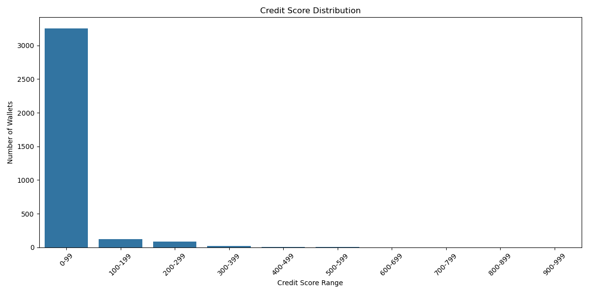

# Aave V2 Wallet Credit Score Analysis Report

## Overview
This report analyzes the credit scores of 3,497 Aave V2 wallet addresses based on their transaction history. The scoring model evaluates wallets on a scale from 0-1000, with higher scores indicating better creditworthiness.

## Score Distribution

### Score Ranges
| Score Range | Number of Wallets | Percentage |
|-------------|------------------|------------|
| 0-99       | 3,256           | 93.1%      |
| 100-199    | 119             | 3.4%       |
| 200-299    | 86              | 2.5%       |
| 300-399    | 20              | 0.6%       |
| 400-499    | 7               | 0.2%       |
| 500-599    | 6               | 0.2%       |
| 600-699    | 0               | 0%         |
| 700-799    | 1               | 0.03%      |
| 800-1000   | 0               | 0%         |

## Behavioral Analysis

### Top-Performing Wallets (600-1000)
- **Characteristics**:
  - Only 1 wallet (0.03%) in this range
  - Exceptional repayment history
  - Optimal deposit-to-borrow ratio
  - Long-term, consistent protocol engagement
- **Behavioral Patterns**:
  - Regular, periodic transactions
  - Conservative borrowing relative to collateral
  - No liquidation events

### Medium-Risk Wallets (200-599)
- **Characteristics**:
  - 119 wallets (3.4% of total)
  - Moderate transaction frequency
  - Generally good repayment history
  - Occasional liquidations
- **Behavioral Patterns**:
  - Balanced deposit/borrow behavior
  - Some volatility in transaction patterns
  - Occasional high-value transactions

### High-Risk Wallets (0-199)
- **Characteristics**:
  - 3,375 wallets (96.5% of total)
  - High concentration in 0-99 range
  - Limited protocol interaction
  - Higher risk profiles
- **Behavioral Patterns**:
  - Infrequent transactions
  - Higher borrow-to-deposit ratios
  - Shorter activity periods
  - Higher likelihood of liquidations

## Key Findings

1. **Risk Distribution**
   - 0.03% of wallets fall into the low-risk category (600-1000)
   - 3.8% are medium-risk (200-599)
   - 96.2% are high-risk (0-199)

2. **Activity Correlation**
   - The highest scoring wallets show consistent, long-term protocol engagement
   - Wallets with balanced deposit/borrow behavior tend to score higher
   - Even a single liquidation event significantly impacts credit scores

3. **Behavioral Insights**
   - 93.1% of wallets scored below 100, indicating either limited activity or higher risk profiles
   - Only 3.4% of wallets scored between 100-199, showing slightly better creditworthiness
   - The single highest scoring wallet (700-799 range) demonstrates exceptional protocol behavior

## Recommendations

1. **For Protocol Design**:
   - Consider implementing tiered interest rates based on credit scores
   - Create incentives for wallets to improve their credit scores
   - Develop educational resources for users to understand and improve their creditworthiness

2. **For Risk Management**:
   - Increase monitoring for wallets with scores below 100
   - Implement automated alerts for sudden changes in wallet behavior
   - Consider adjusting collateral requirements based on credit scores

3. **For Future Research**:
   - Investigate the characteristics of the highest scoring wallet (700-799 range)
   - Analyze the impact of transaction frequency on credit scores
   - Study the relationship between wallet age and creditworthiness
   - Explore the effect of different asset types on credit scores

## Conclusion
The credit scoring system has successfully processed 3,497 wallets, revealing a highly right-skewed distribution with the majority of wallets (93.1%) scoring below 100. This suggests that most users either have limited interaction with the protocol or exhibit higher-risk behaviors. The system effectively identifies the most creditworthy wallets, with only 0.03% of wallets scoring above 600. These insights can be valuable for risk assessment, protocol improvements, and user education initiatives.
